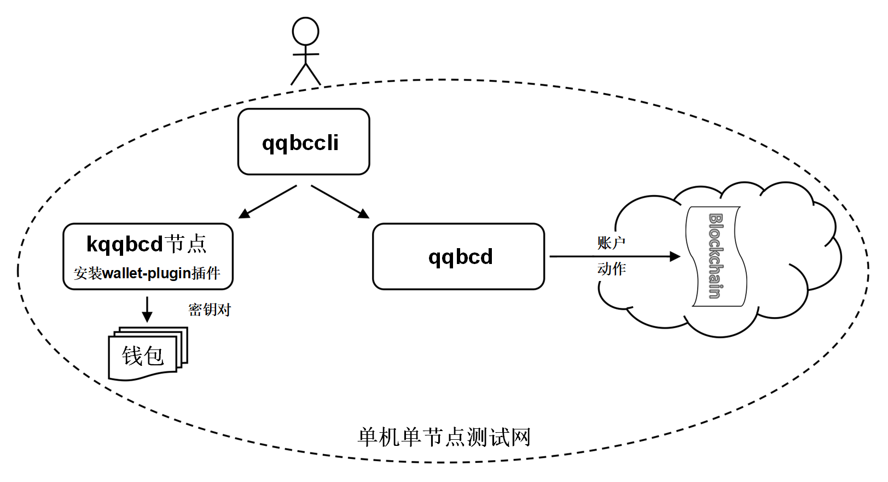

# 本地单节点测试网
---

## 目标

本节介绍如何设置运行在单机上的单节点区块链。该方式称为“单机单节点测试网”。配置目标是在单机上运行区块链并生成区块，结构如下图所示。




在区块链中，`qqbccli`实现钱包管理、账户管理和调用操作，`kqqbcd`执行数字签名等钱包管理。在默认配置下，`kqqbcd` 由`qqbccli`启动。

## 准备工作

* [安装QQBC软件](../../../00_install/index.md)。
* 提供可执行的`qqbcd`、`qqbccli`和`kqqbcd`。如果使用Shell脚本构建QQBC，确保运行[安装脚本](../../../00_install/01_build-from-source/01_shell-scripts/03_install-QQBC-binaries.md)。
* 掌握如何设置[qqbcd选项](../../02_usage/00_qqbcd-options.md)启停特定功能。

## 操作步骤

打开命令行终端窗口，执行如下操作步骤：

1. [启动生产者节点](#1-start-the-producer-node)
2. [获取节点信息](#2-get-node-info)

<span id="1-start-the-producer-node"></span>
### 1. 启动生产者节点

使用如下命令启动单节点区块链：


```sh
qqbcd -e -p QQBC --plugin qqbc::chain_api_plugin --plugin qqbc::history_api_plugin
```

[[提示 | qqbcd最小配置选项]]
| 区块链运行的最小`qqbcd`示例仅需要在`-e`选项中指定`chain_api_plugin`和`history_api_plugin` ，并指定`-p QQBC`选项（此处生产者名称为`QQBC`）。用户也可设置和指定自身账户为生产者名称。

在`qqbcd`运行后将给出日志信息。下面日志显示成功生成区块：


```console
1575001ms thread-0   chain_controller.cpp:235      _push_block          ] initm #1 @2017-09-04T04:26:15  | 0 trx, 0 pending, exectime_ms=0
1575001ms thread-0   producer_plugin.cpp:207       block_production_loo ] initm generated block #1 @ 2017-09-04T04:26:15 with 0 trxs  0 pending
1578001ms thread-0   chain_controller.cpp:235      _push_block          ] initc #2 @2017-09-04T04:26:18  | 0 trx, 0 pending, exectime_ms=0
1578001ms thread-0   producer_plugin.cpp:207       block_production_loo ] initc generated block #2 @ 2017-09-04T04:26:18 with 0 trxs  0 pending
...
QQBC generated block 046b9984... #101527 @ 2018-04-01T14:24:58.000 with 0 trxs
QQBC generated block 5e527ee2... #101528 @ 2018-04-01T14:24:58.500 with 0 trxs
...
```

这样，`qqbcd` 以单生产者 `QQBC`运行。

<span id="2-get-node-info"></span>
### 2. 获取节点信息

下面命令用于获取节点信息

```sh
qqbccli get info
```

命令输入示例如下：

```json
{
  "server_version": "0f9df63e",
  "chain_id": "cf057bbfb72640471fd910bcb67639c22df9f92470936cddc1ade0e2f2e7dc4f",
  "head_block_num": 134,
  "last_irreversible_block_num": 133,
  "last_irreversible_block_id": "00000085060e9872849ef87bef3b19ab07de9faaed71154510c7f0aeeaddae2c",
  "head_block_id": "000000861e3222dce1c7c2cfb938940d8aac22c816cc8b0b89f6bf65a8ad5bdc",
  "head_block_time": "2019-11-18T22:13:10.500",
  "head_block_producer": "QQBC",
  "virtual_block_cpu_limit": 228396,
  "virtual_block_net_limit": 1197744,
  "block_cpu_limit": 199900,
  "block_net_limit": 1048576,
  "server_version_string": "v2.0.0-rc2",
  "fork_db_head_block_num": 134,
  "fork_db_head_block_id": "000000861e3222dce1c7c2cfb938940d8aac22c816cc8b0b89f6bf65a8ad5bdc",
  "server_full_version_string": "v2.0.0-rc2-0f9df63e1eca4dda4cb7df30683f4a1220599444"
}
```

## 高级操作

对于需要修改配置的高级用户，`qqbcd`使用自定义配置目录。不同操作系统下，该目录的位置分别为：
The more advanced user will likely have need to modify the configuration.  `qqbcd` uses a custom configuration folder.  The location of this folder is determined by your system.

* Mac OS：`~/Library/Application\ Support/QQBC/qqbcd/config`
* Linux： `~/.local/share/QQBC/qqbcd/config`

构建时会生成默认的`genesis.json`创世种子文件。用户可通过命令行选项`--config-dir`指定`qqbcd`配置文件夹位置。使用该选项时，确保手工拷贝`genesis.json`到指定配置文件夹中。

 
为使`qqbcd`正常工作，需要正确配置`config.ini`。在启动时，`qqbcd`在指定的配置文件夹中查找`config.ini`。如果文件不存在，那么会创建默认的`config.ini`配置文件。用户如果没有可用的`config.ini` 文件，那么可以运行`qqbcd`并立刻用<kbd>Ctrl-C</kbd>杀死，这样就能在配置文件夹中生成一个默认`config.ini`配置文件。然后可通过编辑该`config.ini`文件，添加或更新默认配置。

```console
# config.ini:

    # Enable production on a stale chain, since a single-node test chain is pretty much always stale
    enable-stale-production = true
    # Enable block production with the testnet producers
    producer-name = QQBC
    # Load the block producer plugin, so you can produce blocks
    plugin = qqbc::producer_plugin
    # As well as API and HTTP plugins
    plugin = qqbc::chain_api_plugin
    plugin = qqbc::http_plugin
    plugin = qqbc::history_api_plugin
```

之后，可使用如下命令运行`qqbcd`，并观察区块的生成情况。

```sh
qqbcd
```

`qqbcd`在用户指定的数据文件夹中存储共享内存、日志内容等运行时数据。各操作系统上的具体文件夹位置为：

* Mac OS：`~/Library/Application\ Support/QQBC/qqbcd/data`
* Linux：`~/.local/share/QQBC/qqbcd/data`
 
用户可使用`qqbcd`命令行参数`--data-dir`指定该数据文件夹。

[[下一篇]]
| 介绍如何设置和运行[单机多节点测试网](01_local-multi-node-testnet.md).
